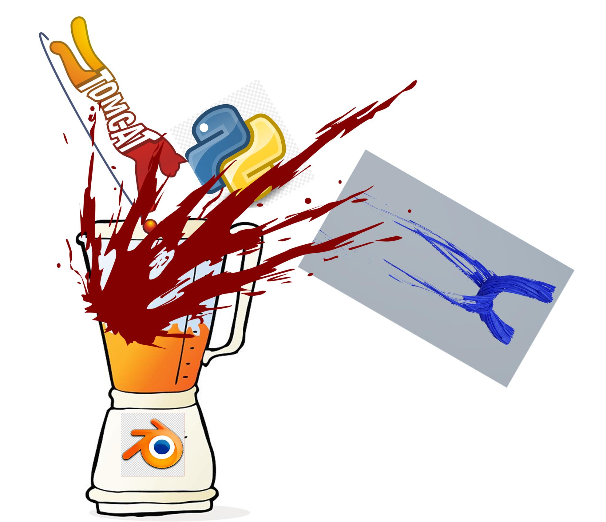

# tomcat_blender



Scripts to automate 4D microtomography data visualization in blender with python.

TODO:
- [ ] make cool logo from current sketch


## How to use

### fancy and more performant way
1. Convert numpy arrays to openvdb files, e.g. 04b_direct_npy_to_vdb.py. Execute the script using the blender python environment (either within blender or CLI) because installing openvdb yourself is a bit of an act. OpenVDB is very useful https://www.youtube.com/watch?v=cqLhhjxch2s.
2. You can load the vdb files as animation in blender and then do everything there without the following steps.
3. I am sorry, I only know the very basics of blender:
   1. Import vdb as volume
   2. create or add a new material to volume with a volume shader
   3. place one or several light sources with sufficient power (blender interprets pixels by default as meters and your CT image are then up to several km high ;)
   4. adjust camera and viewport clipping to see your massive objects
   5. frame your object; trick: lock viewport to camera and "frame selected" vdb volume
   6. select "Cycles"
   7. render:
   		8. single frame: "render image" and save result
     9. data recognized automatically by blender as series: define output folder, "render animation" and come back the next day ;)
		

### Classic way using stl
1. Create data files usable in blender

	1. Extract series stl-files for desired time series with, e.g. 01_extract_surfaces.py, but better use VTK and flying edges either in python or ParaView
	

1. Choose appropitate time step to set up scene and everything (e.g. cycles-render) in blender, do a test render, save the blend-file

1. Run the animation script from command line

	Windows

	```bash
	<path_to_binary>blender.exe blend-file.blend --background --python 05_animscript_using_stl.py
	```
1. (optional) adjust frame and sampling rate, better option: create separate avi-files, merge and convert to mkv, e.g. combining ImageJ and ffmpeg

## Video archiving and compression

Once you have the frames from blender, you can create a video, e.g. by saving a stack in ImageJ to avi. Select none for compression.
Convert ImageJ-avi to mkv as recommended by the ETH research collection for long time storage. Typically reduces file size substantially.

```
ffmpeg -i input.avi output.mkv -acodec libfaac -vcodec ffv1
```

currently best working method to get videos suitable for ppt-presentations:

```
ffmpeg -i input-video.mkv -vf "crop=trunc(iw/2)*2:trunc(ih/2)*2" -q:a 2 -q:v 4 -vcodec wmv2 -acodec wmav2 output-video.avi
```

## Citation

The volume rendering was first used in my PhD thesis

```bibtex
@phdthesis{Fischerthesis,
	title = {Wicking {Dynamics} in {Yarns}, {Knit} {Stitches} and {Fibrous} {Membranes}},
	language = {en},
	school = {ETH Zurich},
	author = {Fischer, Robert},
	year = {2022},
}
```

and later for a peer-reviewed article

```bibtex
@article{Fischer2024,
	title = {Gas-{Induced} {Structural} {Damages} in {Forward}-{Bias} {Bipolar} {Membrane} {CO2} {Electrolysis} {Studied} by {Fast} {X}-ray {Tomography}},
	volume = {7},
	issn = {2574-0962 2574-0962},
	doi = {10.1021/acsaem.3c02882},
	number = {9},
	journal = {ACS Applied Energy Materials},
	author = {Fischer, Robert and Dessiex, Matthieu A. and Marone, Federica and Büchi, Felix N.},
	year = {2024},
	pages = {3590--3601},
	file = {Fischer-2024-Gas-Induced Structural Damages in:C\:\\Users\\rofische\\Zotero\\storage\\FH98YRQW\\Fischer-2024-Gas-Induced Structural Damages in.pdf:application/pdf},
}
```

If you like this repository, please consider a citation.
