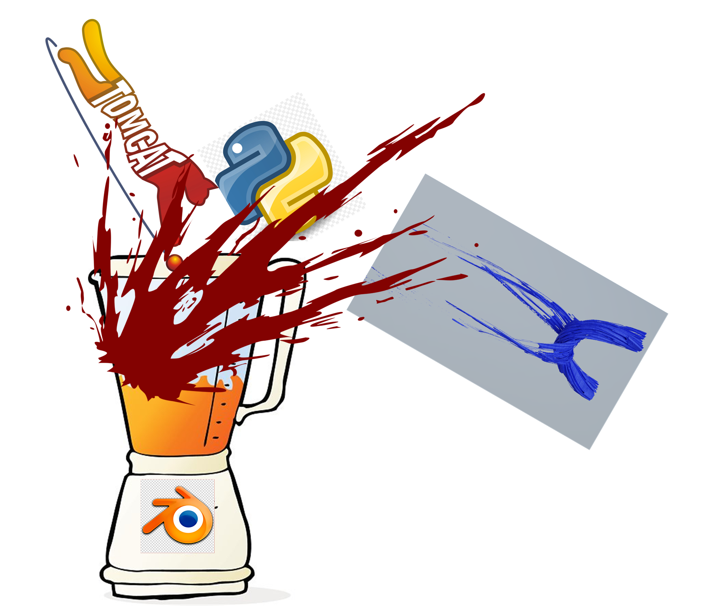

# tomcat_blender



Scripts to automate TOMCAT data visualization in blender with python.
TODO:
- [ ] make cool logo from current sketch
- [ ] build into python module with classes
- [ ] maybe wrap system call of blender
- [x] add cupy/cucim support (partly done)
- [x] use openvdb for volume import in blender

required packages: xarray, scikit-image, trimesh, numpy

## How to use

1. Create data files usable in blender

	1. Extract series stl-files for desired time series with e.g. 01_extract_surfaces.py
	
	or
	
	1. Convert numpy arrays to openvdb files, e.g. 04_npy_to_openvdb_in_blender.py . OpenVDB is very useful https://www.youtube.com/watch?v=cqLhhjxch2s. You can load the vdb files as Animation in blender and then do everything there without the following steps.

1. Choose appropitate time step to set up scene and everything (e.g. cycles-render) in blender, do a test render, save the blend-file

1. Run the animation script from command line

	Windows

	```bash
	<path_to_binary>blender.exe blend-file.blend --background --python testanimscriptfull.py
	```
1. (optional) adjust frame and sampling rate, better option: create separate avi-files, merge and convert to mkv, e.g. combining ImageJ and ffmpeg
